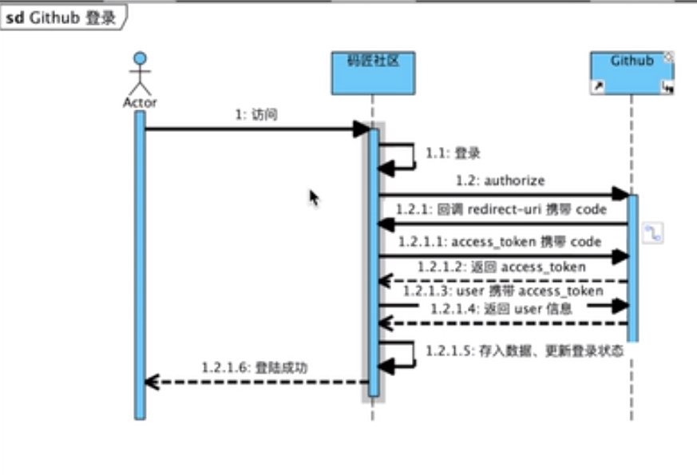

## 社区

## 资料
spring文档

## 工具
git

bootstrap框架

## 开发流程

### 使用github账号登录功能

参考文档：https://developer.github.com/apps/building-oauth-apps/
app id：https://github.com/settings/applications/1242430

用户在网站使用登录功能，具体流程如下：
1. 将页面登录按钮绑定地址，同时携带需要的参数;
2. 通过access_token携带code，获取access_token;
3. 使用access_token获取user信息;

## 脚本

```sql
create table USER
(
    ID         INT auto_increment,
    ACCOUNT_ID VARCHAR(100),
    NAME       VARCHAR(50),
    TOKEN      CHAR(50),
    GMT_CREATE BIGINT,
    GMT_MODIFY BIGINT,
    constraint USER_PK
        primary key (ID)
);


```